Ниже представлен перефразированный вариант отчёта LESSON 3 на основе исходного документа. Все примеры кода, изображения и основные данные сохранены, изменена лишь формулировка текста.

---

**LESSON 3**

В ходе выполнения практических заданий были изучены механизмы явных и неявных Intent, передача данных между активностями, получение результата от дочерней активности, вызов системных приложений, работа с фрагментами и адаптация интерфейса под разные ориентации экрана, а также создание навигационного меню с помощью Navigation Drawer. Каждое задание оформлено как отдельный модуль проекта.

### 1. Передача времени между активностями (IntentApp)

Необходимо разработать приложение с двумя экранами. На первом экране получить текущее системное время, передать его во второй экран через Intent и отобразить там строку: «КВАДРАТ ЗНАЧЕНИЯ МОЕГО НОМЕРА ПО СПИСКУ В ГРУППЕ СОСТАВЛЯЕТ ЧИСЛО, а текущее время ВРЕМЯ». Число – квадрат номера студента по списку (1).

В модуле IntentApp созданы MainActivity и SecondActivity. В MainActivity при нажатии на кнопку формируется строка с текущим временем, упаковывается в Intent с помощью `putExtra()` и запускается SecondActivity. Во второй активности извлекается переданное время, вычисляется квадрат номера (для номера 1 квадрат равен 1) и выводится в TextView.

Фрагмент кода MainActivity:

```java
@Override
protected void onCreate(Bundle savedInstanceState) {
    super.onCreate(savedInstanceState);
    EdgeToEdge.enable(this);
    setContentView(R.layout.activity_main);
    ViewCompat.setOnApplyWindowInsetsListener(findViewById(R.id.main), (v, insets) -> {
        Insets systemBars = insets.getInsets(WindowInsetsCompat.Type.systemBars());
        v.setPadding(systemBars.left, systemBars.top, systemBars.right, systemBars.bottom);
        return insets;
    });
}

public void sendTime(View view) {
    long dateInMillis = System.currentTimeMillis();
    String format = "yyyy-MM-dd HH:mm:ss";
    final SimpleDateFormat sdf = new SimpleDateFormat(format);
    String dateString = sdf.format(new Date(dateInMillis));

    Intent intent = new Intent(this, SecondActivity.class);
    intent.putExtra("time", dateString);
    startActivity(intent);
}
```

Фрагмент кода SecondActivity:

```java
@Override
protected void onCreate(Bundle savedInstanceState) {
    super.onCreate(savedInstanceState);
    setContentView(R.layout.activity_second);

    TextView textView = findViewById(R.id.textView);
    String time = getIntent().getStringExtra("time");

    int myNumber = 1;
    int square = myNumber * myNumber;

    String text = String.format("КВАДРАТ ЗНАЧЕНИЯ МОЕГО НОМЕРА ПО СПИСКУ В ГРУППЕ СОСТАВЛЯЕТ %d, а текущее время %s", square, time);
    textView.setText(text);
}
```

После запуска и нажатия кнопки второй экран отображает корректно отформатированный текст.

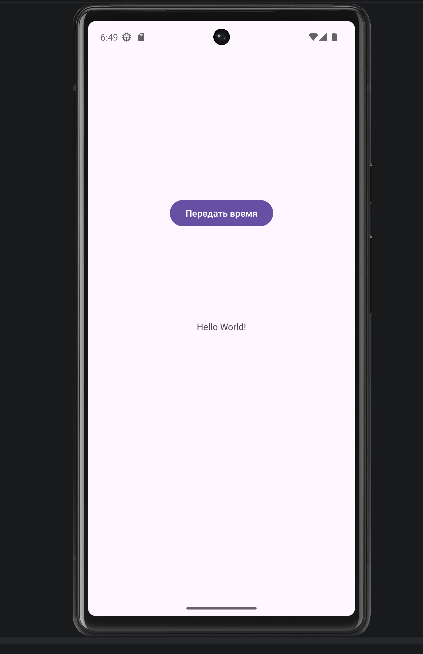
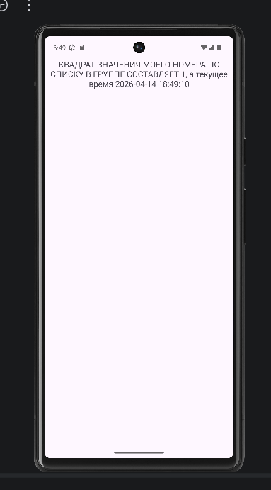

### 2. Возврат названия книги (FavoriteBook)

Требуется создать приложение с двумя экранами. На первом экране отображается текст «Тут появится название вашей любимой книги!» и кнопка для открытия второго экрана. На втором экране показывается любимая книга разработчика («Люцифер»), поле ввода для названия книги пользователя и кнопка отправки. После ввода текста и нажатия на кнопку второй экран закрывается, а на первом экране текст меняется на «Название Вашей любимой книги: …».

Для возврата результата использован Activity Result API. В MainActivity зарегистрирован лаунчер через `registerForActivityResult()`, который обрабатывает результат и обновляет TextView. В ShareActivity при нажатии на кнопку отправки формируется Intent с введённым текстом, вызывается `setResult(RESULT_OK, intent)` и `finish()`.

```java
private ActivityResultLauncher<Intent> activityResultLauncher;
public static final String USER_MESSAGE = "MESSAGE";
private TextView textViewUserBook;

@Override
protected void onCreate(Bundle savedInstanceState) {
    super.onCreate(savedInstanceState);
    setContentView(R.layout.activity_main);

    textViewUserBook = findViewById(R.id.textViewBook);

    activityResultLauncher = registerForActivityResult(
            new ActivityResultContracts.StartActivityForResult(),
            result -> {
                if (result.getResultCode() == Activity.RESULT_OK) {
                    Intent data = result.getData();
                    if (data != null) {
                        String userBook = data.getStringExtra(USER_MESSAGE);
                        textViewUserBook.setText("Название Вашей любимой книги: " + userBook);
                    }
                }
            }
    );
}

public void openInputScreen(View view) {
    Intent intent = new Intent(this, ShareActivity.class);
    activityResultLauncher.launch(intent);
}
```

Отправка результата реализована так:

```java
private EditText editText;

@Override
protected void onCreate(Bundle savedInstanceState) {
    super.onCreate(savedInstanceState);
    setContentView(R.layout.activity_share);

    editText = findViewById(R.id.editTextBook);
}

public void sendData(View view) {
    Intent data = new Intent();
    data.putExtra(MainActivity.USER_MESSAGE, editText.getText().toString());
    setResult(Activity.RESULT_OK, data);
    finish();
}
```

Приложение корректно передаёт введённое название книги обратно на главный экран.

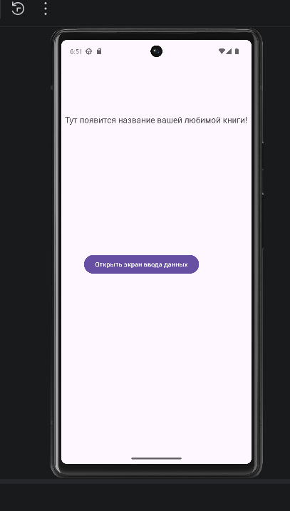
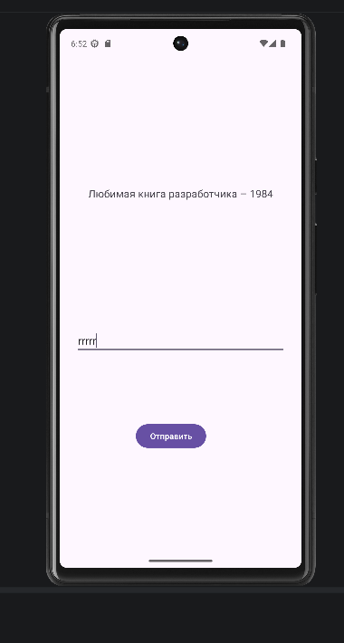
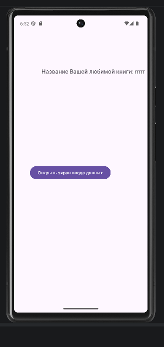

### 3. Вызов системных приложений (SystemIntentsApp)

Необходимо создать приложение с тремя кнопками: «позвонить», «открыть браузер», «открыть карту». При нажатии на каждую кнопку должно вызываться соответствующее системное приложение (набор номера, браузер по умолчанию, карты с координатами).

В разметке activity_main.xml размещены три кнопки с атрибутами `onClick`. В MainActivity реализованы три метода: `onClickCall`, `onClickOpenBrowser`, `onClickOpenMaps`. В каждом методе создаётся Intent с нужным action и data в виде Uri. Для предотвращения вылета при отсутствии приложения добавлена обработка `ActivityNotFoundException`.

MainActivity:

```java
public class MainActivity extends AppCompatActivity {

    @Override
    protected void onCreate(Bundle savedInstanceState) {
        super.onCreate(savedInstanceState);
        EdgeToEdge.enable(this);
        setContentView(R.layout.activity_main);
        ViewCompat.setOnApplyWindowInsetsListener(findViewById(R.id.main), (v, insets) -> {
            Insets systemBars = insets.getInsets(WindowInsetsCompat.Type.systemBars());
            v.setPadding(systemBars.left, systemBars.top, systemBars.right, systemBars.bottom);
            return insets;
        });
    }

    public void onClickCall(View view) {
        Intent intent = new Intent(Intent.ACTION_DIAL);
        intent.setData(Uri.parse("tel:77777777777"));
        startActivity(intent);
    }

    public void onClickOpenBrowser(View view) {
        Intent intent = new Intent(Intent.ACTION_VIEW);
        intent.setData(Uri.parse("http://developer.android.com"));
        startActivity(intent);
    }

    public void onClickOpenMaps(View view) {
        Intent intent = new Intent(Intent.ACTION_VIEW);
        intent.setData(Uri.parse("geo:55.749479,37.613944"));
        startActivity(intent);
    }
}
```

При нажатии на кнопки открываются соответствующие системные приложения. На эмуляторе с Google APIs карты отображают указанные координаты, браузер загружает страницу, открывается диалог набора номера.

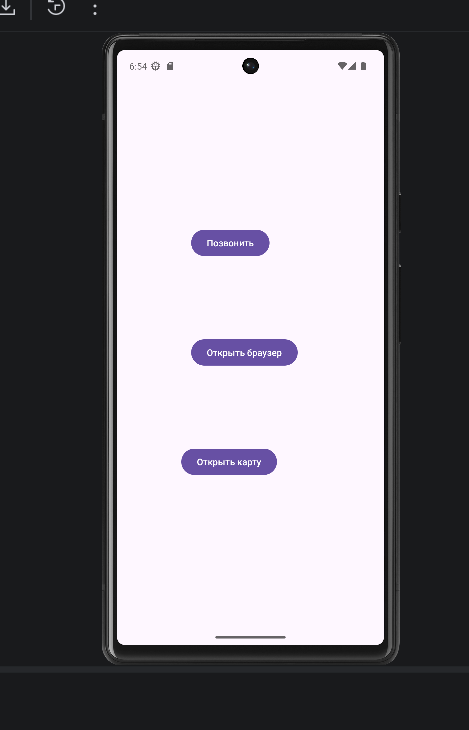
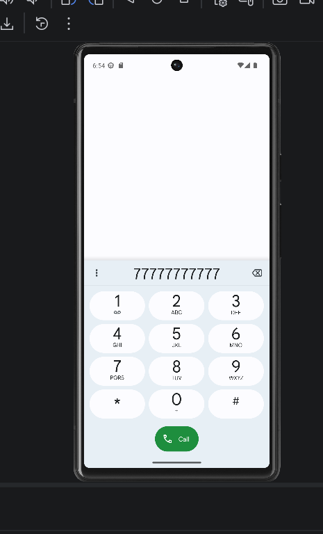
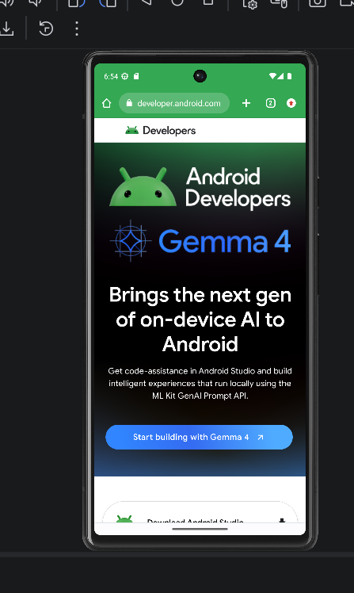
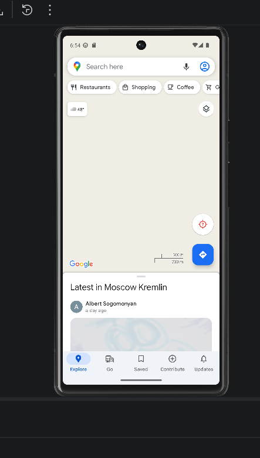

### 4. Фрагменты и поворот экрана (SimpleFragmentApp)

Требовалось создать приложение, которое в портретной ориентации показывает две кнопки для переключения между двумя фрагментами, а в ландшафтной – отображает оба фрагмента одновременно. Фрагменты имеют разные фоновые цвета и текстовое содержимое.

Созданы два фрагмента: FirstFragment и SecondFragment, каждый со своей разметкой. В портретной версии `activity_main.xml` размещены две кнопки и FrameLayout – контейнер для фрагментов. В MainActivity реализована логика замены фрагмента при нажатии на кнопки. Для ландшафтной ориентации создан файл `res/layout-land/activity_main.xml`, в котором вместо кнопок и контейнера размещены два фрагмента, а в коде MainActivity при старте проверяется наличие кнопок (они только в портрете): если кнопок нет, выполнение метода завершается.

Вертикальная разметка:

```xml
<Button android:id="@+id/btnFirstFragment" ... />
<Button android:id="@+id/btnSecondFragment" ... />
<FrameLayout android:id="@+id/fragmentContainer" ... />
```

Горизонтальная разметка:

```xml
<FrameLayout android:id="@+id/fragment1Container" ... />
<FrameLayout android:id="@+id/fragment2Container" ... />
```

Методы внутри MainActivity:

```java
@Override
protected void onCreate(Bundle savedInstanceState) {
    super.onCreate(savedInstanceState);
    setContentView(R.layout.activity_main);

    Button btnFirst = findViewById(R.id.btnFirstFragment);
    Button btnSecond = findViewById(R.id.btnSecondFragment);
    if (btnFirst == null || btnSecond == null) {
        return;
    }

    btnFirst.setOnClickListener(new View.OnClickListener() {
        @Override
        public void onClick(View v) {
            loadFragment(new FirstFragment());
        }
    });

    btnSecond.setOnClickListener(new View.OnClickListener() {
        @Override
        public void onClick(View v) {
            loadFragment(new SecondFragment());
        }
    });
    if (savedInstanceState == null) {
        loadFragment(new FirstFragment());
    }
}

private void loadFragment(Fragment fragment) {
    FragmentManager fm = getSupportFragmentManager();
    FragmentTransaction ft = fm.beginTransaction();
    ft.replace(R.id.fragmentContainer, fragment);
    ft.commit();
}
```

При запуске на телефоне в портретном режиме отображаются кнопки и один фрагмент; при повороте экрана оба фрагмента показываются рядом.

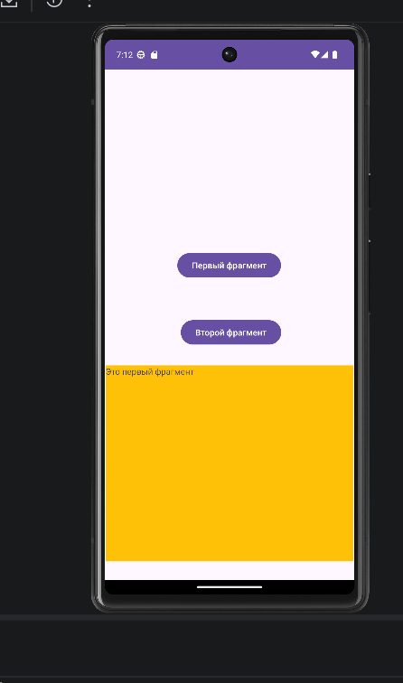
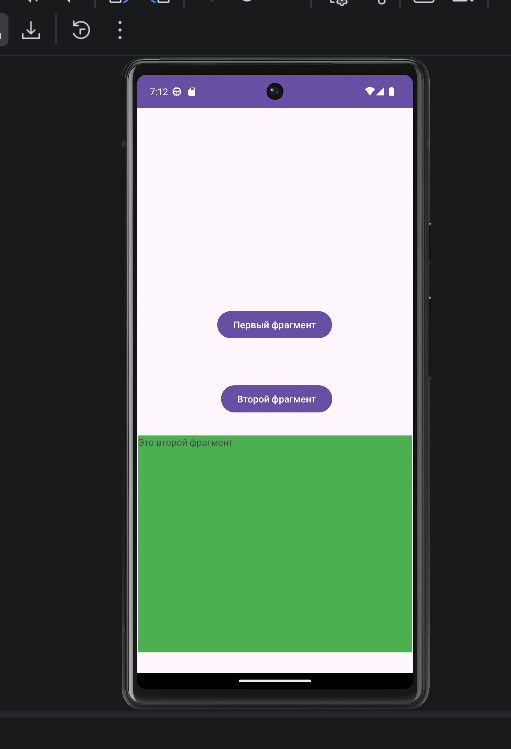
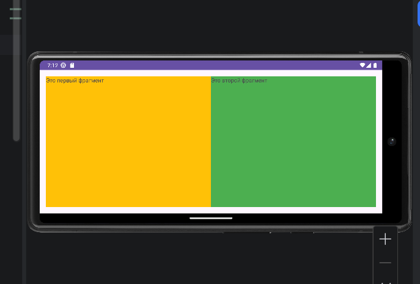

### 5. Контрольное задание: навигационное меню и WebView (MireaProject)

Требовалось создать проект с навигационным меню (боковая шторка), содержащим два пункта: «Дизайн» и «WebView». При выборе первого пункта отображается фрагмент с информацией об интересующей отрасли (стилизация по Material You), при выборе второго – фрагмент со встроенным браузером на базе WebView, загружающий страницу по умолчанию (https://www.mirea.ru).

Поскольку в новых версиях Android Studio шаблон `Navigation Drawer Activity` отсутствует, проект был создан вручную на основе `Empty Views Activity`. Добавлены зависимости `navigation-fragment`, `navigation-ui` и `material`. Созданы навигационный граф `res/navigation/mobile_navigation.xml`, два фрагмента (`DataFragment` и `WebViewFragment`), меню `res/menu/activity_main_drawer.xml`, разметка `activity_main.xml` с `DrawerLayout`, `Toolbar` и `NavHostFragment`. В `MainActivity` настроена связь тулбара, меню и навигации. В `WebViewFragment` включена поддержка JavaScript и загружен сайт. В манифест добавлено разрешение `INTERNET`.

Разметка mobile_navigation.xml:

```xml
<?xml version="1.0" encoding="utf-8"?>
<navigation xmlns:android="http://schemas.android.com/apk/res/android"
    xmlns:app="http://schemas.android.com/apk/res-auto"
    xmlns:tools="http://schemas.android.com/tools"
    android:id="@+id/mobile_navigation"
    app:startDestination="@id/nav_home">

    <fragment
        android:id="@+id/nav_home"
        android:name="ru.mirea.aleksandrovnd.mirea_project.HomeFragment"
        android:label="Главная"
        tools:layout="@layout/fragment_home" />

    <fragment
        android:id="@+id/nav_data"
        android:name="ru.mirea.aleksandrovnd.mirea_project.DataFragment"
        android:label="Дизайн" />

    <fragment
        android:id="@+id/nav_webview"
        android:name="ru.mirea.aleksandrovnd.mirea_project.WebViewFragment"
        android:label="WebView" />
</navigation>
```

Класс фрагмента WebViewFragment:

```java
public class WebViewFragment extends Fragment {
    @Override
    public View onCreateView(LayoutInflater inflater, ViewGroup container,
                             Bundle savedInstanceState) {
        View view = inflater.inflate(R.layout.fragment_web_view, container, false);
        WebView webView = view.findViewById(R.id.webView);
        webView.getSettings().setJavaScriptEnabled(true);
        webView.setWebViewClient(new WebViewClient());
        webView.loadUrl("https://www.mirea.ru");
        return view;
    }
}
```

Настройка навигации в MainActivity:

```java
public class MainActivity extends AppCompatActivity {
    private DrawerLayout drawerLayout;
    private AppBarConfiguration appBarConfiguration;

    @Override
    protected void onCreate(Bundle savedInstanceState) {
        super.onCreate(savedInstanceState);
        setContentView(R.layout.activity_main);

        Toolbar toolbar = findViewById(R.id.toolbar);
        setSupportActionBar(toolbar);

        drawerLayout = findViewById(R.id.drawer_layout);
        NavigationView navigationView = findViewById(R.id.nav_view);

        NavHostFragment navHostFragment = (NavHostFragment) getSupportFragmentManager()
                .findFragmentById(R.id.nav_host_fragment);
        NavController navController = navHostFragment.getNavController();

        appBarConfiguration = new AppBarConfiguration.Builder(
                R.id.nav_home, R.id.nav_data, R.id.nav_webview)
                .setOpenableLayout(drawerLayout)
                .build();

        NavigationUI.setupActionBarWithNavController(this, navController, appBarConfiguration);
        NavigationUI.setupWithNavController(navigationView, navController);
    }

    @Override
    public boolean onSupportNavigateUp() {
        NavController navController = ((NavHostFragment) getSupportFragmentManager()
                .findFragmentById(R.id.nav_host_fragment)).getNavController();
        return NavigationUI.navigateUp(navController, appBarConfiguration)
                || super.onSupportNavigateUp();
    }
}
```

Приложение успешно запускается. В тулбаре отображается иконка «гамбургер», при нажатии на неё выезжает боковое меню. Переключение между фрагментами происходит плавно. WebView корректно отображает веб-страницу.

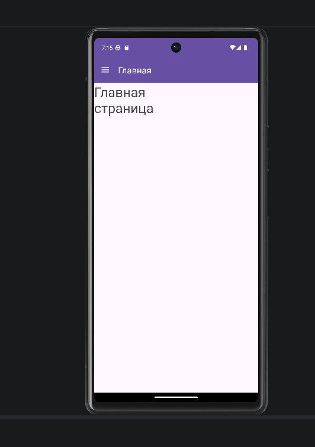
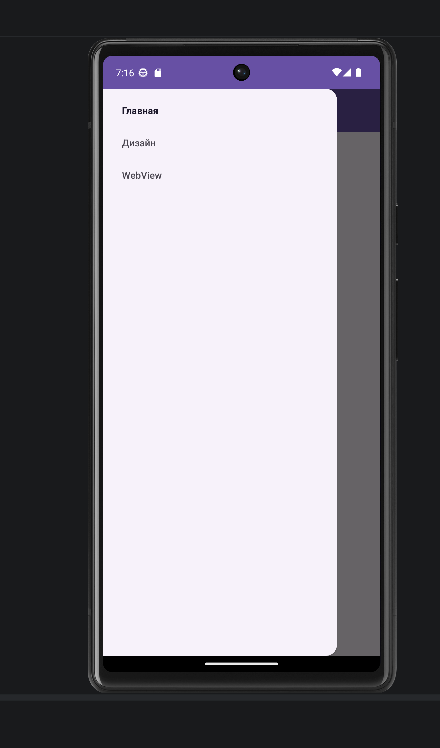
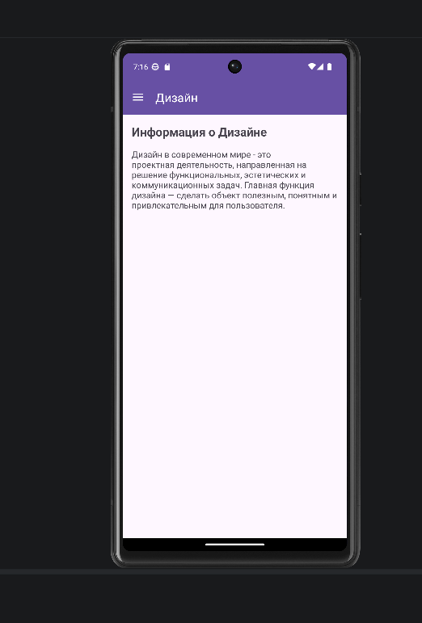
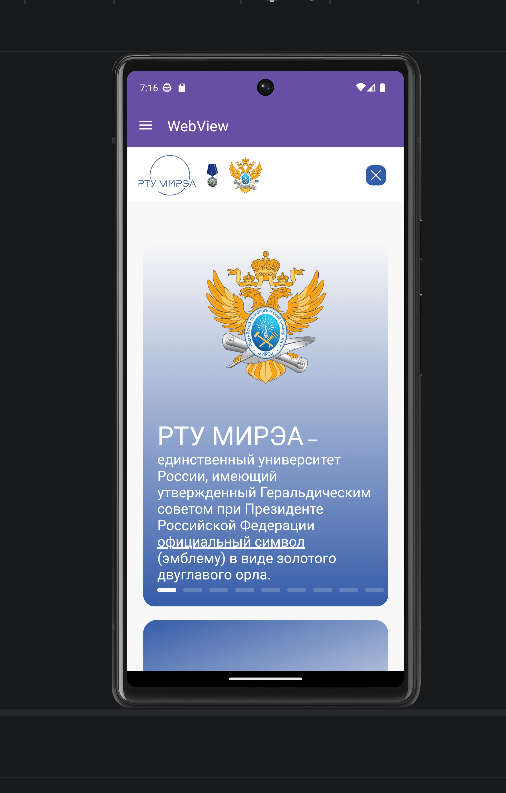